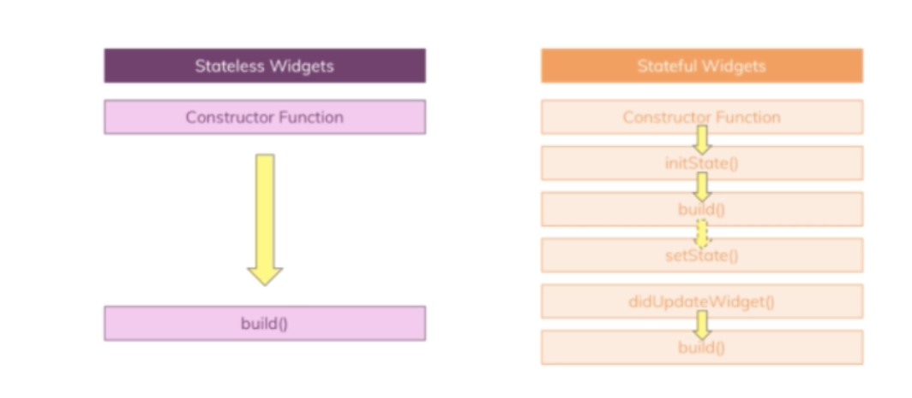
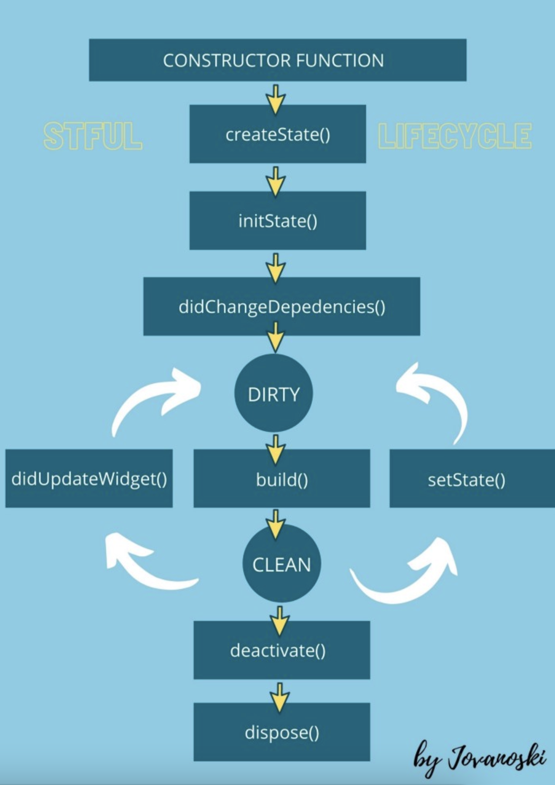
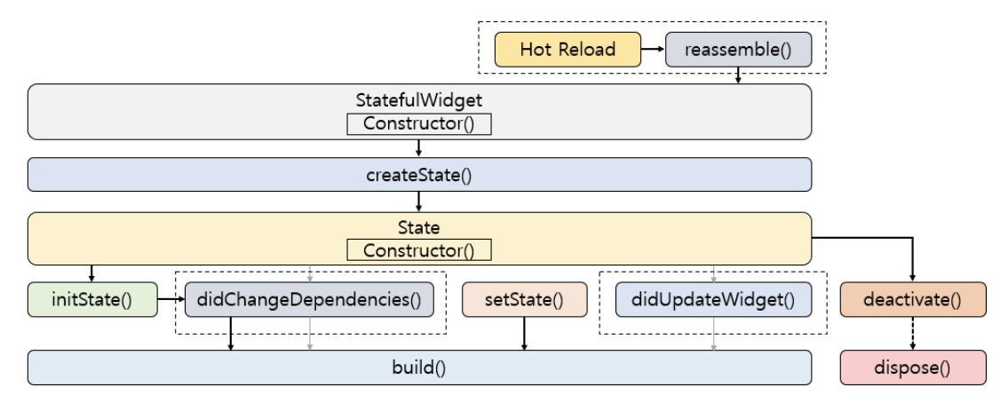
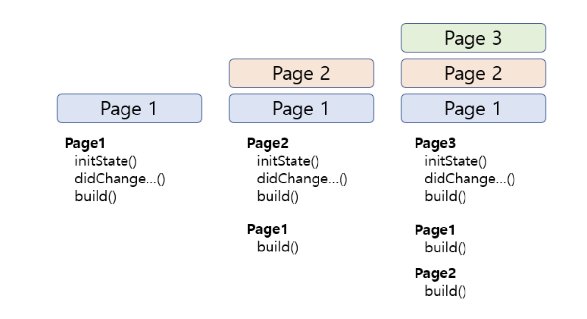

# 생명주기 Life Cycle

### <p align="center"> Stateless 와 Stateful </p>
<p align="center"></p>


<br>

## 1. Stateless Widget

- **변경할 수 없는 상태**를 가지는 위젯이다.
- build 시, 위젯을 한 번만 그리고 다시 그리지 않는다.
- State는 Immutable 하다고 할 수 있다.

<br>


## 2. Stateful Widget

- 상태가 변경됨에 따라 build를 여러 번 하는 위젯이다.
- State object와 결합하게 되며, setState 메서드를 사용해서 수시로 업데이트 할 수 있다.

<br>

다음은 Stateful의 Life Cycle이다.
<p align="center"></p>

- **mounted**  
  - 'state가 현재 tree에 존재하는지?'
  - state가 dispose되기 전까지 mounted는 유지된다. (mounted = true)
  - 모든 위젯은 bool 타입의 this.mounted 속성을 가지고 있다.
  - buildContext가 할당되면 mounted = true를 리턴한다.
  - true = 위젯을 제어할 수 있는 BuildContext에 접근할 수 있다는 의미다.

<br>

- **createState()**  
  - Stateful 생명주기의 시작점이다.
  - createState가 state를 생성하면 buildContext는 state에 할당된다.
  - widget에 대한 모든 변경 가능한 state가 유지되는 곳이다.
  - mounted 속성은 true로 변경된다. 
  ```java
  class LoginScreen extends StatefulWidget {
  const LoginScreen({Key? key}) : super(key: key);

  @override
  State<LoginScreen> createState() => _LoginScreenState();
  }
  
  class _LoginScreenState extends State<LoginScreen> {
  @override
  Widget build(BuildContext context) {
    return Container();
  }
  }
  ```

<br>

- **initState()**  
  - 위젯이 생성될 때 처음으로 호출되며 딱 한 번만 호출된다.
  - 생성된 위젯 인스턴스에 의존적인 데이터 또는 속성 초기화에 주로 사용된다.
  - super.initState() 호출 필수.
  - Stream, 알림변경, 위젯 데이터 변경이 가능한 객체 핸들링에 사용하는 것이 좋다.
  
<br>

- **didChangeDependencies()**  
  - 위젯이 최초 생성될 때 initState 다음에 호출된다.
  ```java
  @override
  void didChangeDependencies() {
    // TODO: implement didChangeDependencies
    super.didChangeDependencies();
  }
  ```

<br>

- **didUpdateWidget()**  
  - 부모 위젯의 구성이 변경되거나 위젯을 다시 build 해야하는 경우에 호출된다.
  ```java
  @override
  void didUpdateWidget(covariant LoginScreen oldWidget) {
    // TODO: implement didUpdateWidget
    super.didUpdateWidget(oldWidget);
  }
  ```

<br>

- **build()**  
  - didChangeDependencies() 다음에 처음 호출된다.
  - 생명주기 동안 여러 번 호출되며, setState에 속한 위젯이 업데이트 될 때마다 실행된다.
    - didUpdateWidget() 또는 setState() 메서드가 호출될 때마다 build() 실행.

<br>

- **setState()**  
  - framework 또는 개발자로 부터 호출되는 메서드.
  - setState() 메서드로 데이터를 변경할 수 있으며, '데이터가 변경되었음'을 framework에 알리는데 사용되며 위젯을 rebuild 한다.

<br>

- **deactivate()**  
  - 위젯 트리에서 state가 제거될 때 호출된다.
  - 거의 사용되지 않음.

<br>

- **dispose()**  
  - 위젯 트리에서 state가 영구적으로 제거될 때 호출된다.

<br>

***

- Hot Reload를 실행할 때마다 **reassemble()** 메서드가 호출된다. 호출된 이후 아래 그림처럼 생명주기가 순서대로 진행된다.
<p align="center"></p>


<br>

- '이전' 페이지로 돌아갈 수 있는 건, Stateful Widget이 Stack 구조로 되어있기 때문이다.
<p align="center"></p>