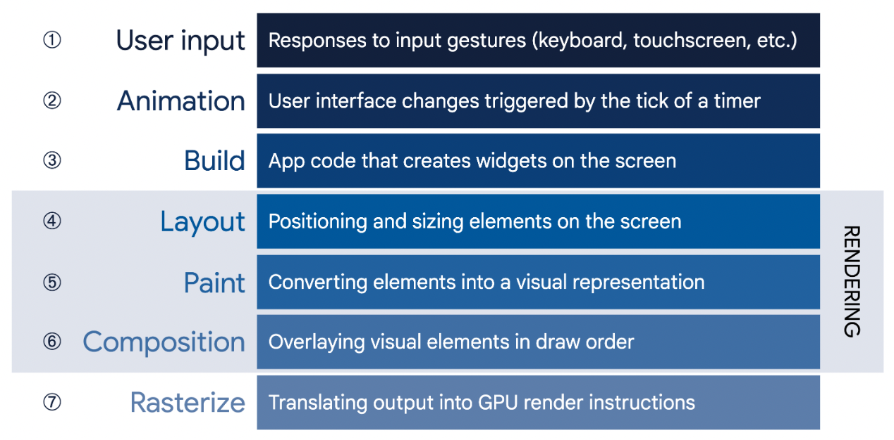
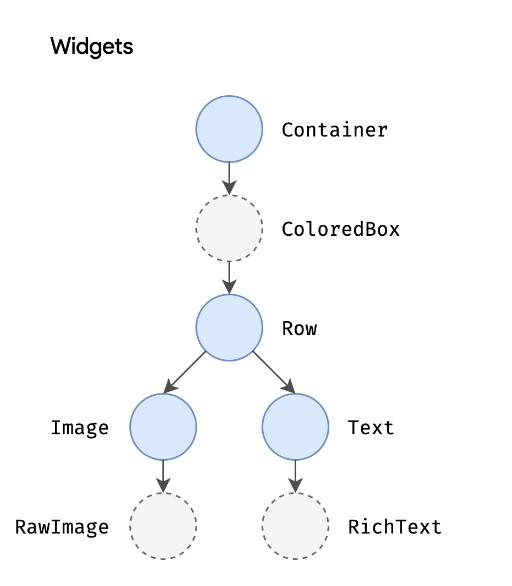
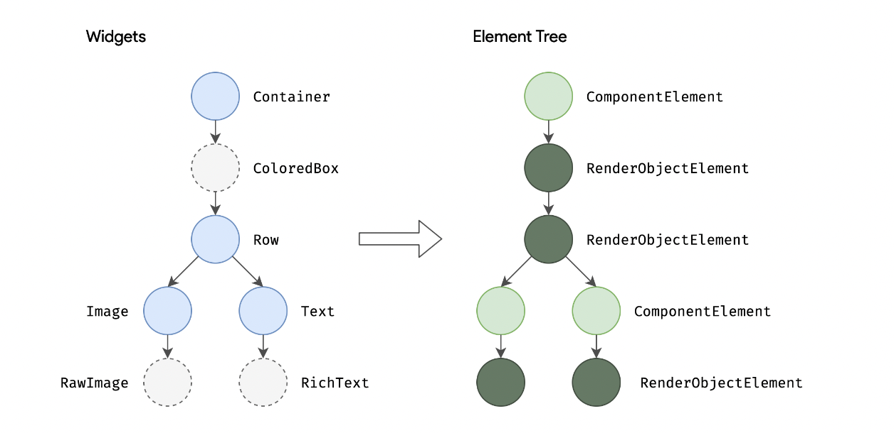
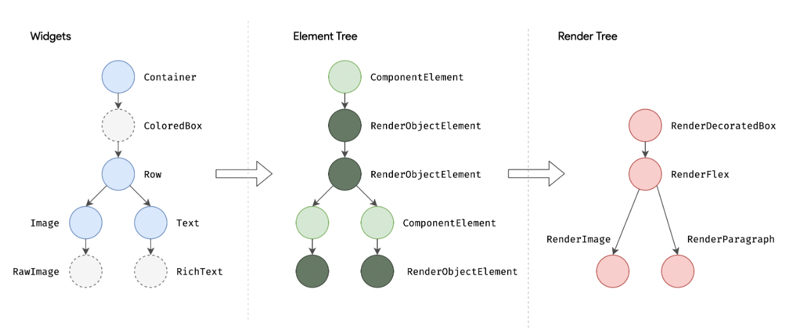
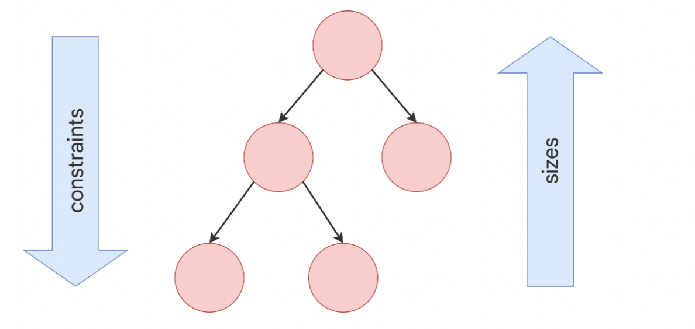

# 렌더링 원리 - 1.Tree


## 플러터는 어떻게 화면을 렌더링 할까?  feat. 공식 문서

<br>

### <center> 🚀 Simple is fast & Everything's a Widget

<br>

### # Flutter Rendering 파이프라인

<p align="center"></p>


## 1. Flutter의 렌더링 과정은 3개의 트리 구조로 되어있다.   

    3개의 트리를 사용하는 이유는 렌더링 성능을 보장하기 위함이다.
    한 번 화면을 그린 다음에는 전체 화면을 다시 재렌더링 하는 게 아니라 필요한 부분만 다시 그리기 위해서다.

<br>

- ### **(1) Widget Tree**
  - Widget은 Element의 설정을 설명한다.
  - 즉, 사용자가 widget을 작성하면 Flutter는 Widget Tree를 구성한다.(코드 작성)

```java
Container(
  color: Colors.blue,
  child: Row(
    children: [
      Image.network('https://www.example.com/1.png'),
      const Text('A'),
    ],
  ),
);
```

위 코드를 작성하면 아래 그림과 같은 Widget Tree가 구성된다.
<p align="center"></p>

<br>

- ### **(2) Element Tree**
  - Element는 Widget의 인스턴스이다.
  - Flutter는 Widget Tree를 Element Tree로 변환한다.
  - Flutter의 Life Cycle은 이 Element가 관리한다.

    
    아래 그림을 보면 Element Tree에는 두 가지 종류가 있다.

<p align="center"></p>


- **ComponentElement**
  - 다른 element의 host 역할을 한다.
  - Flutter는 화면을 그릴 때 이 요소는 참고하지 않는다.

<br>

- **RenderObjectElement**
  - rendering의 다음 단계인 Layout, paint 단계에 직접 참여하는 element이다.


<br>
  
- ### **(3) Render Tree**
  - Element Tree를 보고 Render Tree를 만든다.
  - 이 트리에는 rendering에 반드시 필요한 내용만 담는다.(UI를 그리기 위한 정보)
    - Element Tree에서 만들어진 **RenderObjectElement**를 바탕으로 구성된다.
    - **RenderObject**를 상속한 클래스로 이루어진다.

<p align="center"></p>

    최종적으로 Layout을 수행하기 위해 만들어진 Render Tree를 탐색하고 제약 조건을 전달하는 작업을 수행한다.
    즉, 위젯이 어느 위치에 어떤 사이즈로 그려질지 결정하는 단계이다.


<p align="center"></p>


1. parent 노드는 child 노드에게 제약 조건(constraints)을 전달한다.
2. parent 노드로부터 제약 조건을 받은 child 노드는 해당 정보를 바탕으로 자신의 크기를 결정한다.
3. 즉, parent가 제약 조건을 child에게 보내고 다시 아래에서 위로 size에 대한 정보를 올려보내는 과정이다.


<br>


