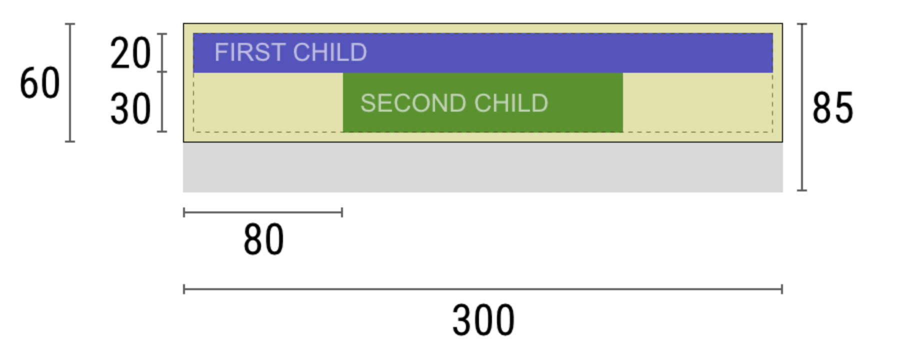

## 플러터는 어떻게 화면을 렌더링 할까?  feat. 공식 문서

 

# 렌더링 원리 - 2.Constraints

 

    앞서 렌더링 파이프라인에서 widget을 rendering하는 방법인 '3가지 트리'에 대해 알아봤다.
    이번에는 widget을 tree로 만든 후, 각 widget이 어떤 크기와 위치로 정해지고 화면에 그려지는지에 대해 알아보려한다.
    파이프라인에서는 Layout 단계에 해당하며 element tree를 사용해 위젯의 크기와 위치를 결정한다.

 

###  🎢 "Constraints go down. Sizes go up. Parent sets position."

    위젯의 크기와 위치를 결정하는데는 3단계로 볼 수 있다.
    flutter는 만들어진 element tree에 있는 각 노드를 방문하면서 3단계의 일을 수행한다.

 

### 1단계: Constraints go down
- 루트 노드에서 각 노드를 하나씩 들려 제약 조건(constraints)을 전달한다. parent가 child에게 제약 조건 전달.
- 이 과정은 child 위젯의 크기를 알기 위함이다.
- parent가 최대,최소 크기의 범위를 child에게 전달하면 child는 받은 범위 내에서 자신의 크기를 결정한다.

 

### 2단계: Sizes go up
- parent로 부터 제약 조건을 받은 child가 자신의 크기를 결정하고 다시 parent에게 알려주는 과정이다. 
- 트리의 리프 노드부터 하나씩 차례대로 자신의 parent를 방문하며 올라온다.

 

### 3단계: Parent sets position
- parent는 자신의 child로부터 받은 크기로 child의 정확한 위치와 크기를 정할 수 있다.

 

## 예시

[플러터 공식문서](https://docs.flutter.dev/development/ui/layout/constraints)에 나와있는 예시를 보면 위 과정을 쉽게 이해 할 수 있다.

 

아래 대화에서 'Widget'은 위 그림에서 노란색 부분이며 Column에 해당된다.

    Widget: Hey parent, what are my constraints?
    
    Parent: You must be from 80 to 300 pixels wide, and 30 to 85 tall.
    
    Widget: Hmmm, since I want to have 5 pixels of padding, then my children can have at most 290 pixels of width and 75 pixels of height.
    
   widget 역시 자신의 parent에게 제약 조건을 받고 자신의 크기를 결정한 뒤, child에게 알려준다.
   여기서는 자신을 padding 5픽셀로 정한 뒤, 크기를 child에게 내려보낸다.

    Widget: Hey first child, You must be from 0 to 290 pixels wide, and 0 to 75 tall.

    First child: OK, then I wish to be 290 pixels wide, and 20 pixels tall.

    Widget: Hmmm, since I want to put my second child below the first one, this leaves only 55 pixels of height for my second child.

    Widget: Hey second child, You must be from 0 to 290 wide, and 0 to 55 tall.

    Second child: OK, I wish to be 140 pixels wide, and 30 pixels tall.

   모든 child 위젯의 정확한 크기를 받은 parent는 각 위치를 정할 수 있다.
   그리고 자신의 child처럼, Widget도 자신의 parent에게 크기를 알려준다.

    Widget: “Very well. My first child has position x: 5 and y: 5, and my second child has x: 80 and y: 25.”
    Widget: “Hey parent, I’ve decided that my size is going to be 300 pixels wide, and 60 pixels tall.”

## Limitaions

- 위젯은 parent에 의해 주어진 제약 조건 내에서만 크기를 결정할 수 있다. 즉, 위젯이 항상 자신이 원하느 크기를 가질 수 있는 건 아니다.
- 자신의 parent가 위젯의 위치를 결정하기 때문에 위젯은 화면에서 자신의 위치를 알 수도, 결정할 수도 없다.
- parent의 크기와 위치도 parent의 parent에 따라 달라지기 때문에 트리 전체를 고려하지 않고 위젯의 크기와 위치를 정확하게 정의할 수 없다.
- child가 parent와 다른 크기를 원하는 경우, parent가 이를 정렬할 수 있는 충분한 정보를 가지고 있지 않으면 child의 크기가 무시될 수 있다.
